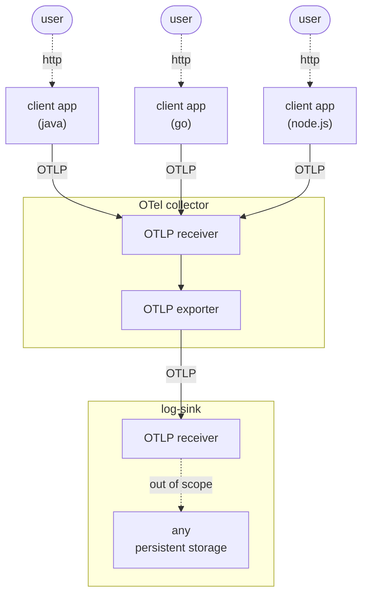

# Architectural Concept Document (ACD): Audit Log POC with OpenTelemetry

## Table of Contents

1. [EXECUTIVE SUMMARY](#1-executive-summary)
2. [INTRODUCTION](#2-introduction)
3. [BUSINESS CASE](#3-business-case)
4. [ARCHITECTURE OVERVIEW](#4-architecture-overview)
   - 4.1 [System Components](#41-system-components)
   - 4.3 [Architecture Diagram](#43-architecture-diagram)
5. [ARCHITECTURE DECISIONS](#5-architecture-decisions)
6. [OPEN POINTS](#6-open-points)
7. [CONCLUSION AND NEXT STEPS](#7-conclusion-and-next-steps)
8. [DECISION PROTOCOL](#8-decision-protocol)
9. [APPENDIX](#9-appendix)

---

## 1. EXECUTIVE SUMMARY

This Architectural Concept Document (ACD) presents a Proof of Concept (POC) for implementing OpenTelemetry (Otel) SDK’s logging features in
a distributed architecture. The POC centers on a Recommendation Service generating log data, which traverses several processing layers en
route to Audit Log Services V3. The objective is to test logging message integrity, identify data loss points, and optimize telemetry flows
for robust observability.

---

## 2. INTRODUCTION

This document details a technical blueprint for leveraging OpenTelemetry’s logging SDK within a cloud-native architecture. The focus is to
assess potential logging message loss and performance bottlenecks, primarily within the Recommendation Service and its downstream audit log
pipeline.

---

## 3. BUSINESS CASE

Ensuring audit logs are reliably captured and transmitted is critical for compliance, troubleshooting, and operational visibility. The
adoption of OpenTelemetry promises unified observability but raises questions regarding potential data loss and reliability, particularly
when logs traverse complex or unreliable network paths. This POC provides a structured method to evaluate, optimize, and ultimately
standardize audit logging practices.

---

## 4. ARCHITECTURE OVERVIEW

### 4.1 System Components

| Component                         | Description                                                               |
| --------------------------------- | ------------------------------------------------------------------------- |
| **Recommendation Service**        | Microservice instrumented with Otel SDK for log generation.               |
| **SDK Exporter**                  | In-process module that forwards log data to Otel Collector.               |
| **Otel Collector**                | Middleware node aggregating, processing, and routing logs.                |
| **Processors**                    | Sub-components within Otel Collector (filtering, enriching, batching).    |
| **AuditLog Services V3 Exporter** | Sends the finalized log data to external Audit Log endpoint via internet. |

### 4.3 Architecture Diagram

<!-- https://www.mermaidchart.com/play -->

## 5. ARCHITECTURE DECISIONS

Use OpenTelemetry SDK within application code for cross-vendor and standardized telemetry generation. Externalize processing to Otel
Collector for operational flexibility without code deployment. Employ processors (filtering, batching) for scaling and compliance with
remote API limits. Decouple network transmission from application code, handing over all egress responsibilities to Otel Collector.
Instrument with checkpoints and monitoring at each component boundary for reliability assessment. Select AuditLog Services V3 Exporter due
to organizational integration requirements.

## 6. OPEN POINTS

Otel SDK & Collector Version Compatibility: Need to validate if all required features and data formats are supported. API Rate Limits &
Back-pressure: How will surges and API slowdowns/throttling be gracefully handled? Data Privacy & Security: Ensure logging data is
sanitized/encrypted as required before egress. Collector Failure Modes: What happens to logs if Otel Collector crashes or network partition
occurs? Lossy Operations in Processors: Need clear bounds on filtering/batching impacts to log completeness.

## 7. CONCLUSION AND NEXT STEPS

This POC will validate the comprehensive logging flow’s reliability and highlight improvements for audit log delivery. Next steps include:

Building and deploying test harnesses for each stage. Executing validation and stress tests. Analyzing end-to-end message integrity/loss
metrics. Tuning collector/processors for optimal throughput and minimal loss. Compiling a findings and recommendations report for broader
system rollout.

## 8. DECISION PROTOCOL

Decisions Tracked: All key design changes/choices documented in versioned change log. Review Frequency: Weekly checkpoints during POC,
rolling up to steering committee.

## 9. APPENDIX

References to OpenTelemetry documentation Diagrams (link/attachments) API schemas and configs Example log events Test plans and scripts
