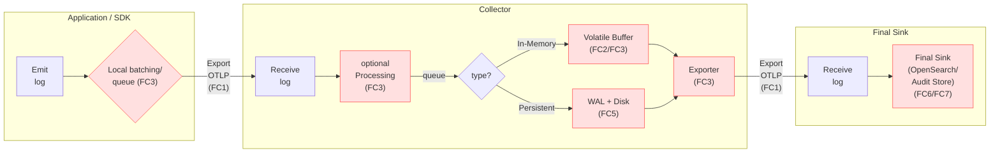
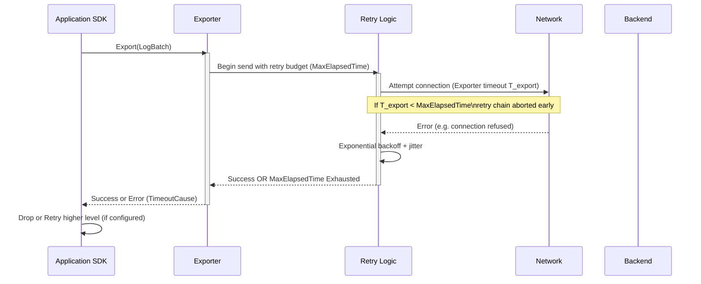

<!-- markdownlint-disable-file MD025 -->
<!-- markdownlint-disable-file MD013 -->

# Toward Practical (Near) Guaranteed Delivery of OpenTelemetry Logs

This document summarizes lessons learned from building resilient OpenTelemetry (OTel) log pipelines for audit-grade reliability. It proposes
best practices and incremental improvements for the open-source community.

## Problem Statement

Organizations with regulatory or forensic needs require extremely low probability of log loss from Application SDK → Collector tiers →
Intermediate durability → Final sink. Today OTel offers building blocks (retry, batching, queues, WAL, message queues) but lacks an
opinionated, end-to-end durability pattern and unified semantics. Misaligned timeouts, limited visibility into where drops occur, and
fragmented persistence options lead to avoidable loss.

Goal: Move toward an operationally achievable near-zero loss posture for defined failure envelopes ("soft guarantee") while documenting
unavoidable catastrophic scenarios.

We explicitly distinguish:

- Soft Guarantee: No loss if failures are transient and within configured durability windows (queue depth, retention times).
- Hard Guarantee: Only loss if catastrophic, out-of-scope events (permanent disk destruction, multi-site outage) occur.

## Community Alignment

This proposal is designed to serve as a concrete implementation plan for the goals outlined in the official
**[OpenTelemetry Project Proposal: Audit Logging SIG (#2409)](https://github.com/open-telemetry/community/pull/2409)**. It directly
addresses the community's need for higher delivery guarantees, improved observability for dropped data, and clearer semantic conventions for
audit events.

Furthermore, the recommendations within this document align with the strategic direction of the OpenTelemetry Collector for improving
reliability, particularly the migration towards exporter-native batching as tracked in **[Introduce new exporter helper with batching option
(#8122)][batchv2]**. This PoC and its findings are intended to provide tangible data and a reference implementation for Phase 2 of the Audit
Logging SIG's charter: contributing functional extensions back upstream.

## Canonical Delivery Path & Loss Points

The table below summarizes the canonical end-to-end delivery path for a log record and the principal places where data can be lost. The
diagram that follows visualizes the same path and highlights where buffering, batching and persistence typically occur.

| Stage | Failures | Component                                 | Loss Modes (Today)                                                                                              | Observability Gaps                                                          |
| ----- | -------- | ----------------------------------------- | --------------------------------------------------------------------------------------------------------------- | --------------------------------------------------------------------------- |
| A     | FC3      | App SDK / exporter                        | Local queue/batch full; exporter timeout shorter than retry window; process crash (no persistence)              | Inconsistent metrics to show pre-export drops                               |
| B     | FC1      | Network to Agent/Gateway                  | Connection refused before retry engages (confusing timeouts); TLS handshake failures; transient DNS issues      | Hard to attribute which timeout (batch processor vs exporter vs gRPC)       |
| C     | FC2,FC3  | Collector In-Memory Sending Queue         | Queue full under sustained backpressure; force-shutdown before drain; single retry during graceful drain (logs) | No standard “dropped due to shutdown” counter                               |
| D     | FC5      | Collector Persistent Queue (file_storage) | Disk full, fsync disabled (WAL gap on host crash), node ephemeral storage wiped, PV detach stalls               | No size‑based (bytes) quota preemption/alert in some impls; partial metrics |
| E     | FC1,FC6  | Gateway Exporter to Final Sink            | Same as C/D; sink 429/5xx beyond MaxElapsedTime; mis-tuned timeouts shorter than retry budget                   | Lack of “end-to-end age latency” distribution metric                        |
| F     | FC6,FC7  | Final Sink                                | Index rejection (mapping error), security filter, shard overload                                                | These failures may appear as generic 5xx without semantic classification    |

## Failure Class Taxonomy

This taxonomy groups the common failure classes observed in the PoC and in community incident analysis. It is intended as a lightweight,
implementation-neutral vocabulary that helps map observed drops to actionable mitigations.

| Id  | Class             | Examples                      | Mitigation                               |
| --- | ----------------- | ----------------------------- | ---------------------------------------- |
| FC1 | Transient Network | brief 5xx, connection refused | Exponential retry + persistent buffering |
| FC2 | Surge/Burst       | sudden volume spike           | Elastic queue sizing + backpressure      |
| FC3 | Process Crash     | pod OOMKill/upgrade           | WAL + restart replay                     |
| FC4 | Node Restart      | drain/hibernation             | External MQ or HA replication            |
| FC5 | Storage Pressure  | disk full                     | Predictive monitoring + watermarks       |
| FC6 | Systemic Outage   | long backend downtime         | Durable MQ + extended retention          |
| FC7 | Data Tampering    | on-node modification          | Integrity hashing & encryption (future)  |

## Current Best Practices

This section lists immediate, deployable practices we recommend today. Where a recommendation depends on upcoming Collector features (for
example, exporter-native batching) the dependency is called out so teams can plan pilots or progressive rollouts.

We've compiled these practices into a separate **[Guidance Document](./ideal-setup.md)** for operational reference.

### Application / SDK

- Align exporter timeouts ≥ retry MaxElapsedTime; warn if mismatch.
- Use synchronous or bounded batching for high-criticality audit logs.
- Standardize counters: `records_attempted`, `records_exported`, `records_failed_transient`, `records_failed_permanent`.

### Collector

- Enable `sending_queue` for remote exporters; persistent queue for critical paths when operable.
- Avoid redundant asynchronous batch processor if receiver already batches (e.g. Filelog implicit batching).
- Graceful shutdown timeout > largest expected retry + flush window.
- Metrics to surface: queue size/capacity, persisted items, disk bytes (proposed), dropped with reason label.
- fsync strategy: choose between performance (false) and durability (always/interval). Benchmark early.
- Prefer exporter-native batching ([exporter helper][batchv2] v2) and plan deprecation of legacy batch processor per exporter once feature
  parity confirmed; do not double-layer batch processor + [exporter batcher][batchv2] except during a short, monitored migration window.
- When exporter-native batching is enabled, adopt byte-based queue sizing after observing 95th percentile serialized batch sizes for at
  least 24h; set initial byte capacity ≈ P95 \* queue_items_cap.
- For multi-exporter fanout, configure exactly one exporter (e.g. primary durability path) with `drop_on_error=false` and all secondary
  exporters with `drop_on_error=true` to prevent duplicate retries.
- Expose per-exporter batching metrics (batches_built_total, batch_build_duration, batch_bytes) to support sizing and early anomaly
  detection.

### Operations

- Dual SLO: Loss Rate + P99 Age Latency.
- Chaos drills: simulate backend outage, disk full, SIGKILL mid-burst.
- Canary mirror sink for checksum comparison.
- Instrument failover & connector paths: track `failover_active_level`, `failover_transition_total`, `failover_level_duration_seconds`, and
  per-connector drop/export counts to reduce [MTTR][MTTR].
- Treat sustained exporter queue > 70% capacity together with rising `otelcol_exporter_send_failed_*` as a backend bottleneck (scale backend
  or introduce buffering), not just a collector scaling signal.
- Monitor memory limiter refused metrics (`otelcol_processor_refused_*`) as early pressure indicators; correlate with queue occupancy before
  scaling.

### Security / Integrity (Future)

- Hash chaining per batch in persistent queue.
- Pluggable encryption at Client SDK for regulated domains.

## Lessons Learned

The following lessons were distilled from the PoC, test runs, and incident reviews; they explain why certain recommendations exist and
motivate the improvement proposals in the next section.

| Area                       | Insight                                                                                                                             |
| -------------------------- | ----------------------------------------------------------------------------------------------------------------------------------- |
| Timeout Fragmentation      | Layered timeouts cause premature abort (see OTLP Go issue [#6588](https://github.com/open-telemetry/opentelemetry-go/issues/6588)). |
| Hidden Batching            | Filelog implicit batching can remove need for batch processor.                                                                      |
| Shutdown Loss              | In-memory queue drains only single retry; risk of silent drop.                                                                      |
| Disk Limits                | Lack of byte-based cap complicates sizing; risk of node pressure.                                                                   |
| Retry Semantics            | Ambiguity around connection-establishment vs post-connection transient errors.                                                      |
| Loss Attribution           | Need structured drop reason taxonomy for root cause.                                                                                |
| PV Operational Friction    | Volume reattachment delays decrease HA viability.                                                                                   |
| Backpressure Signaling     | No standardized upstream throttle advisory.                                                                                         |
| Batching Layer Duplication | Running legacy batch processor plus exporter batcher increases latency and obscures failure attribution.                            |
| Failover Visibility        | Limited built-in metrics for failover transitions and active priority level.                                                        |
| Connector Loss Attribution | Drops inside connectors (routing/aggregation) often misattributed to exporters.                                                     |

## Improvements

The proposals below collect candidate OTEPs and implementation items. They are a menu of potential community deliverables — some are
low-effort docs/metric changes, others require Collector or SDK code. The table is not strictly ordered; see "Prioritized Actions" for the
recommended short-term focus.

### Improvement Proposals (Candidate OTEPs)

| ID  | Proposal                                                                   | Benefit                                                                       | Effort  | Trade-Off                     | Affected Component(s)    |
| --- | -------------------------------------------------------------------------- | ----------------------------------------------------------------------------- | ------- | ----------------------------- | ------------------------ |
| P1  | Drop reason taxonomy + metrics                                             | Root cause clarity (addresses Audit SIG need for event catalog)               | Med     | Metric cardinality            | Collector, API/SemConv   |
| P2  | Unified timeout model & auto-alignment warning                             | Prevent premature abort                                                       | Low     | Surprise for advanced tuners  | Collector, SDK           |
| P3  | Enhanced shutdown drain with multi-retry / grace window                    | Fewer restart losses                                                          | Med     | Longer rollout time           | Collector                |
| P4  | Byte-based queue limits & watermarks                                       | Predictive disk mgmt (aligns with exporter-native sizing in [#8122][batchv2]) | Med     | Complexity                    | Collector                |
| P5  | Hash chain integrity plugin                                                | Tamper evidence (addresses Audit SIG immutability requirement)                | Med     | CPU overhead                  | Collector (extension)    |
| P6  | Standard backpressure advisory to SDK                                      | Coordinated flow control (addresses Audit SIG "fail vs. throw" debate)        | High    | Multi-language changes        | API, SDK, Collector      |
| P7  | Durability level taxonomy in docs                                          | Clear trade-offs                                                              | Low     | None                          | Docs                     |
| P8  | Exporter batcher graduation guidance                                       | Simplify pipeline (aligns with strategic direction in [#8122][batchv2])       | Med     | Adoption path                 | Docs, Collector          |
| P9  | fsync policy modes (always/interval/none)                                  | Tunable durability                                                            | Low-Med | Perf variance                 | Collector                |
| P10 | End-to-end UUID trace per record (optional)                                | Forensic traceability                                                         | Med     | Privacy considerations        | API, SDK, Collector      |
| P11 | Survivability window heuristic metric                                      | Operator awareness                                                            | Low     | Estimate accuracy             | Collector                |
| P12 | Adaptive hybrid queue (memory→persistent on backpressure)                  | Latency + resilience                                                          | High    | Complexity & correctness      | Collector                |
| P13 | Batch processor deprecation & migration playbook                           | Reduced duplication (core goal of [#8122][batchv2])                           | Low-Med | Coordination across exporters | Docs, Collector          |
| P14 | Failover connector telemetry spec (active level, transitions, durations)   | Faster failover MTTR                                                          | Med     | Expanded metric set           | Collector (contrib)      |
| P15 | Connector drop reason extension (`connector_failure`, `routing_unmatched`) | Precise attribution                                                           | Low     | Cardinality increase          | Collector (contrib)      |
| P16 | Byte-based queue guardrails & heuristic warnings                           | Prevent mis-sizing (enabled by exporter-native batching in [#8122][batchv2])  | Med     | Heuristic false positives     | Collector                |
| P17 | Graceful failover drain option                                             | Lower in-flight loss                                                          | High    | Longer failover latency       | Collector (contrib)      |
| P18 | Partition-aware / multi-tenant exporter batching guidance                  | Avoid [HoL][HoL] blocking                                                     | Med     | Config complexity             | Collector, Docs          |
| P19 | Durability mode annotation metric (`pipeline_durability_mode`)             | Auditability                                                                  | Low     | More time series              | Collector                |
| P20 | Connector backpressure hook (upstream throttle signal)                     | Unified flow control                                                          | High    | Cross-component changes       | API, Collector (contrib) |

### Prioritized Actions

This short list is a near-term priority selected from the larger proposals above. It is intended to deliver quick wins that significantly
reduce unexplained drops and improve operator visibility.

1. Align timeouts (docs), ensure retry - especially when connection loss/establishment is involved. Might require code changes in some
   dependencies (gRPC/http libraries) or in their usage.
2. Focus on Client SDK persistency (+ retry).
3. Double check relevant metrics around queuing, batching, timeouts and retries etc.

### Longer-Term Experiments

The items below are research or experimental efforts that require more design, testing, or cross-project coordination before they are
appropriate for production adoption.

- Adaptive hybrid queue state machine (NORMAL → DEGRADED → RECOVERY). — A state machine that automatically moves from memory buffering to
  persistent buffering under high load and recovers when pressure subsides. Benefits: predictable degradation; risks: added state complexity
  and correctness challenges. E.g. the first time something requires a retry, queuing moves from in-memory to persistent. When the queue is
  drained (or after a certain amount of time), it moves back to in memory.
- Backpressure signaling spec extension (HTTP header / gRPC status mapping). — Define how upstreams/SDKs signal throttling requests to avoid
  blind retries. Benefits: coordinated flow control; Problem: cross-language adoption cost.
- Integrity hashing plugin reference implementation. — Provide a reference for hash chaining / tamper evidence on persisted batches.
  Benefits: tamper detection; risks: CPU/IO overhead and key management considerations. Maybe together with encryption at rest?

## Risk & Trade-Off Matrix

This matrix maps proposed changes to primary risks and mitigations. Use it to inform prioritization decisions and to guide experimental
rollouts for higher-risk items.

| Change                            | Risk                        | Mitigation                               |
| --------------------------------- | --------------------------- | ---------------------------------------- |
| fsync always                      | Throughput drop             | Provide interval mode + benchmarks (P9)  |
| Persistent queues ubiquitous      | Disk exhaustion             | Watermarks + alerts (P4)                 |
| Detailed drop metrics             | Cardinality                 | Fixed enum, cap reasons (P1)             |
| Hybrid queue                      | State bugs                  | Formal spec + property tests (P12)       |
| Backpressure propagation          | SDK complexity              | Feature flag progressive rollout (P20)   |
| Dual batching (legacy + exporter) | Added latency & confusion   | Migration playbook (P13)                 |
| Failover flapping                 | Oscillation, burst pressure | Cooldown + hysteresis metrics (P14)      |
| Connector telemetry expansion     | Metric overhead             | Limit enum set; sampling if needed (P15) |

## Open Questions

1. Scope definition: Should "Guaranteed" explicitly declare catastrophe boundaries?
2. Introduce `durability_level` config attribute to drive auto defaults?
3. Integrity hashing: in-scope for OTel or delegated downstream?
4. Metric design: single counter with reason label vs multiple counters?
5. Adaptive queue: start as experimental extension before spec adoption?

## Call to Action

This section lists concrete ways the community can help. When opening issues or PRs, reference the proposal IDs above (for example "P1: drop
reason taxonomy") so reviewers can quickly map work to the document's intent.

- Comment on proposal prioritization (P1–P12).
- Volunteer for metric taxonomy (P1) and queue byte limit (P4) implementation.
- Share real incident postmortems for timeout/loss attribution.
- Provide fsync performance benchmark data (interval vs none).

## Timeout Chain Interaction Diagram

Effective retry window = MIN(ExporterOperationTimeout, BatchProcessorExportTimeout, ContextCancellation) — if < RetryMaxElapsedTime then
“latent” configuration hazard → emit warning.

## Draft Drop Reason Enum

`queue_full`, `disk_full`, `shutdown_drain_timeout`, `retry_exhausted`, `serialization_error`, `network_unreachable`, `backend_rejected`,
`integrity_failed` (future), `connector_failure`, `routing_unmatched`, `failover_during_switch`, `unknown`.

[MTTR]: https://en.wikipedia.org/wiki/Mean_time_to_repair
[HoL]: https://en.wikipedia.org/wiki/Head-of-line_blocking
[batchv2]: https://github.com/open-telemetry/opentelemetry-collector/issues/8122
