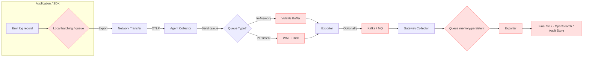
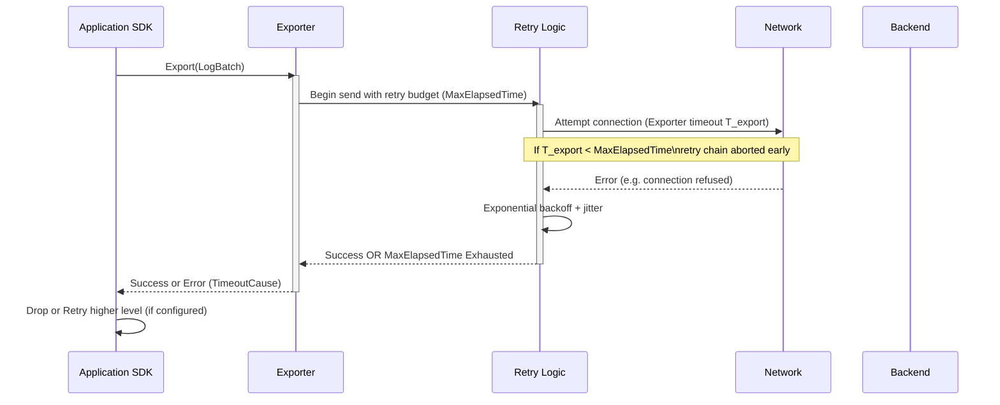

<!-- markdownlint-disable-file MD025 -->
<!-- markdownlint-disable-file MD013 -->

# Toward Practical (Near) Guaranteed Delivery of OpenTelemetry Logs

This document summarizes lessons learned from building resilient OpenTelemetry (OTel) log pipelines for audit-grade reliability. It proposes
best practices and incremental improvements for the open-source community.

## 1. Problem Statement

Organizations with regulatory or forensic needs require extremely low probability of log loss from Application SDK → Collector tiers →
Intermediate durability → Final sink. Today OTel offers building blocks (retry, batching, queues, WAL, message queues) but lacks an
opinionated, end-to-end durability pattern and unified semantics. Misaligned timeouts, limited visibility into where drops occur, and
fragmented persistence options lead to avoidable loss.

Goal: Move toward an operationally achievable near-zero loss posture for defined failure envelopes ("soft guarantee") while documenting
unavoidable catastrophic scenarios.

We explicitly distinguish:

- Soft Guarantee: No loss if failures are transient and within configured durability windows (queue depth, retention times).
- Hard Guarantee: Only loss if catastrophic, out-of-scope events (permanent disk destruction, multi-site outage) occur.

## 2. Canonical Delivery Path & Loss Points

| Stage | Component                                 | Loss Modes (Today)                                                                                              | Observability Gaps                                                          |
| ----- | ----------------------------------------- | --------------------------------------------------------------------------------------------------------------- | --------------------------------------------------------------------------- |
| A     | App SDK / exporter                        | Local queue/batch full; exporter timeout shorter than retry window; process crash (no persistence)              | Inconsistent metrics to show pre-export drops                               |
| B     | Network to Agent/Gateway                  | Connection refused before retry engages (confusing timeouts); TLS handshake failures; transient DNS issues      | Hard to attribute which timeout (batch processor vs exporter vs gRPC)       |
| C     | Collector In-Memory Sending Queue         | Queue full under sustained backpressure; force-shutdown before drain; single retry during graceful drain (logs) | No standard “dropped due to shutdown” counter                               |
| D     | Collector Persistent Queue (file_storage) | Disk full, fsync disabled (WAL gap on host crash), node ephemeral storage wiped, PV detach stalls               | No size‑based (bytes) quota preemption/alert in some impls; partial metrics |
| E     | Gateway Exporter to Final Sink            | Same as C/D; sink 429/5xx beyond MaxElapsedTime; mis-tuned timeouts shorter than retry budget                   | Lack of “end-to-end age latency” distribution metric                        |
| F     | Final Storage / Index                     | Index rejection (mapping error), security filter, shard overload                                                | These failures may appear as generic 5xx without semantic classification    |

## 3. Failure Class Taxonomy

| Class             | Examples                      | Mitigation                               |
| ----------------- | ----------------------------- | ---------------------------------------- |
| Transient Network | brief 5xx, connection refused | Exponential retry + persistent buffering |
| Surge/Burst       | sudden volume spike           | Elastic queue sizing + backpressure      |
| Process Crash     | pod OOMKill/upgrade           | WAL + restart replay                     |
| Node Restart      | drain/hibernation             | External MQ or HA replication            |
| Storage Pressure  | disk full                     | Predictive monitoring + watermarks       |
| Systemic Outage   | long backend downtime         | Durable MQ + extended retention          |
| Data Tampering    | on-node modification          | Integrity hashing & encryption (future)  |

## 4. Current Best Practices

### Application / SDK

- Align exporter timeouts ≥ retry MaxElapsedTime; warn if mismatch.
- Use synchronous or bounded batching for high-criticality audit logs.
- Standardize counters: `records_attempted`, `records_exported`, `records_failed_transient`, `records_failed_permanent`.

### Collector

- Enable `sending_queue` for remote exporters; persistent queue for critical paths when operable.
- Avoid redundant asynchronous batch processor if receiver already batches (e.g. Filelog implicit batching).
- Graceful shutdown timeout > largest expected retry + flush window.
- Metrics to surface: queue size/capacity, persisted items, disk bytes (proposed), dropped with reason label.
- fsync strategy: choose between performance (false) and durability (always/interval). Benchmark early.
- Prefer exporter-native batching (exporter helper v2) and plan deprecation of legacy batch processor per exporter once feature parity
  confirmed; do not double-layer batch processor + exporter batcher except during a short, monitored migration window.
- When exporter-native batching is enabled, adopt byte-based queue sizing after observing 95th percentile serialized batch sizes for at
  least 24h; set initial byte cap ≈ P95 \* queue_items_cap.
- For multi-exporter fanout, configure exactly one exporter (e.g. primary durability path) with `drop_on_error=false` and all secondary
  exporters with `drop_on_error=true` to prevent duplicate retries.
- Expose per-exporter batching metrics (batches_built_total, batch_build_duration, batch_bytes) to support sizing and early anomaly
  detection.

### Operations

- Dual SLO: Loss Rate + P99 Age Latency.
- Chaos drills: simulate backend outage, disk full, SIGKILL mid-burst.
- Canary mirror sink for checksum comparison.
- Instrument failover & connector paths: track `failover_active_level`, `failover_transition_total`, `failover_level_duration_seconds`, and
  per-connector drop/export counts to reduce MTTR.
- Treat sustained exporter queue > 70% capacity together with rising `otelcol_exporter_send_failed_*` as a backend bottleneck (scale backend
  or introduce buffering), not just a collector scaling signal.
- Monitor memory limiter refused metrics (`otelcol_processor_refused_*`) as early pressure indicators; correlate with queue occupancy before
  scaling.

### Security / Integrity (Future)

- Hash chaining per batch in persistent queue.
- Pluggable encryption at rest for regulated domains.

## 5. Lessons Learned

| Area                       | Insight                                                                                                                             |
| -------------------------- | ----------------------------------------------------------------------------------------------------------------------------------- |
| Timeout Fragmentation      | Layered timeouts cause premature abort (see OTLP Go issue [#6588](https://github.com/open-telemetry/opentelemetry-go/issues/6588)). |
| Hidden Batching            | Filelog implicit batching can remove need for batch processor.                                                                      |
| Shutdown Loss              | In-memory queue drains only single retry; risk of silent drop.                                                                      |
| Disk Limits                | Lack of byte-based cap complicates sizing; risk of node pressure.                                                                   |
| Retry Semantics            | Ambiguity around connection-establishment vs post-connection transient errors.                                                      |
| Loss Attribution           | Need structured drop reason taxonomy for root cause.                                                                                |
| PV Operational Friction    | Volume reattachment delays decrease HA viability.                                                                                   |
| Backpressure Signaling     | No standardized upstream throttle advisory.                                                                                         |
| Batching Layer Duplication | Running legacy batch processor plus exporter batcher increases latency and obscures failure attribution.                            |
| Failover Visibility        | Limited built-in metrics for failover transitions and active priority level.                                                        |
| Connector Loss Attribution | Drops inside connectors (routing/aggregation) often misattributed to exporters.                                                     |

## 6. Improvement Proposals (Candidate OTEPs)

| ID  | Proposal                                                                   | Benefit                  | Effort  | Trade-Off                     |
| --- | -------------------------------------------------------------------------- | ------------------------ | ------- | ----------------------------- |
| P1  | Drop reason taxonomy + metrics                                             | Root cause clarity       | Med     | Metric cardinality            |
| P2  | Unified timeout model & auto-alignment warning                             | Prevent premature abort  | Low     | Surprise for advanced tuners  |
| P3  | Enhanced shutdown drain with multi-retry / grace window                    | Fewer restart losses     | Med     | Longer rollout time           |
| P4  | Byte-based queue limits & watermarks                                       | Predictive disk mgmt     | Med     | Complexity                    |
| P5  | Hash chain integrity plugin                                                | Tamper evidence          | Med     | CPU overhead                  |
| P6  | Standard backpressure advisory to SDK                                      | Coordinated flow control | High    | Multi-language changes        |
| P7  | Durability level taxonomy in docs                                          | Clear trade-offs         | Low     | None                          |
| P8  | Exporter batcher graduation guidance                                       | Simplify pipeline        | Med     | Adoption path                 |
| P9  | fsync policy modes (always/interval/none)                                  | Tunable durability       | Low-Med | Perf variance                 |
| P10 | End-to-end UUID trace per record (optional)                                | Forensic traceability    | Med     | Privacy considerations        |
| P11 | Survivability window heuristic metric                                      | Operator awareness       | Low     | Estimate accuracy             |
| P12 | Adaptive hybrid queue (memory→persistent on backpressure)                  | Latency + resilience     | High    | Complexity & correctness      |
| P13 | Batch processor deprecation & migration playbook                           | Reduced duplication      | Low-Med | Coordination across exporters |
| P14 | Failover connector telemetry spec (active level, transitions, durations)   | Faster failover MTTR     | Med     | Expanded metric set           |
| P15 | Connector drop reason extension (`connector_failure`, `routing_unmatched`) | Precise attribution      | Low     | Cardinality increase          |
| P16 | Byte-based queue guardrails & heuristic warnings                           | Prevent mis-sizing       | Med     | Heuristic false positives     |
| P17 | Graceful failover drain option                                             | Lower in-flight loss     | High    | Longer failover latency       |
| P18 | Partition-aware / multi-tenant exporter batching guidance                  | Avoid HoL blocking       | Med     | Config complexity             |
| P19 | Durability mode annotation metric (`pipeline_durability_mode`)             | Auditability             | Low     | More time series              |
| P20 | Connector backpressure hook (upstream throttle signal)                     | Unified flow control     | High    | Cross-component changes       |

## 7. Prioritized Actions

1. Docs: timeout alignment diagram + durability levels matrix.
2. Metrics: implement P1 in collector.
3. Warning: emit log if retry budget exceeds any shorter timeout.
4. Prototype byte-based queue limit (P4) behind feature flag.
5. Exporter batcher guidance blog post (P8).
6. Loss investigation issue template.

## 8. Longer-Term Experiments

- Adaptive hybrid queue state machine (NORMAL → DEGRADED → RECOVERY).
- Backpressure signaling spec extension (HTTP header / gRPC status mapping).
- Integrity hashing plugin reference implementation.

## 9. Risk & Trade-Off Matrix

| Change                            | Risk                        | Mitigation                          |
| --------------------------------- | --------------------------- | ----------------------------------- |
| fsync always                      | Throughput drop             | Provide interval mode + benchmarks  |
| Persistent queues ubiquitous      | Disk exhaustion             | Watermarks + alerts                 |
| Detailed drop metrics             | Cardinality                 | Fixed enum, cap reasons             |
| Hybrid queue                      | State bugs                  | Formal spec + property tests        |
| Backpressure propagation          | SDK complexity              | Feature flag progressive rollout    |
| Dual batching (legacy + exporter) | Added latency & confusion   | Migration playbook (P13)            |
| Failover flapping                 | Oscillation, burst pressure | Cooldown + hysteresis metrics (P14) |
| Connector telemetry expansion     | Metric overhead             | Limit enum set; sampling if needed  |

## 10. Success Metrics

| Metric                                         | Target                 |
| ---------------------------------------------- | ---------------------- |
| Unattributed drops (%)                         | < 5%                   |
| MTTR for loss investigation                    | < 30m                  |
| Issues about timeout confusion                 | Downward trend         |
| fsync interval overhead                        | < 15% throughput hit   |
| Adoption of drop taxonomy (top distros)        | > 80%                  |
| Pipelines migrated to exporter-native batching | > 90% (target horizon) |
| Mean failover detection time                   | < 10s                  |
| Unexplained connector-origin drops             | < 5% of total drops    |

## 11. Gold Pipeline Checklist

| Layer               | Mandatory                                                      | Optional (High Assurance)    |
| ------------------- | -------------------------------------------------------------- | ---------------------------- |
| SDK                 | Timeout >= retry, export counters                              | Backpressure handling        |
| Agent               | Persistent queue (interval fsync)                              | Integrity hashing            |
| Gateway             | Memory queue + exporter batcher                                | Mirror sink for validation   |
| Monitoring          | Drop reasons dashboard                                         | Automated chaos drills       |
| Failover (optional) | Failover connector with telemetry (active level & transitions) | Graceful drain before switch |

## 12. Open Questions

1. Scope definition: Should "Guaranteed" explicitly declare catastrophe boundaries?
2. Introduce `durability_level` config attribute to drive auto defaults?
3. Integrity hashing: in-scope for OTel or delegated downstream?
4. Metric design: single counter with reason label vs multiple counters?
5. Adaptive queue: start as experimental extension before spec adoption?

## 13. Call to Action

- Comment on proposal prioritization (P1–P12).
- Volunteer for metric taxonomy (P1) and queue byte limit (P4) implementation.
- Share real incident postmortems for timeout/loss attribution.
- Provide fsync performance benchmark data (interval vs none).

## 14. Timeout Chain Interaction Diagram

Effective retry window = MIN(ExporterOperationTimeout, BatchProcessorExportTimeout, ContextCancellation) — if < RetryMaxElapsedTime then
“latent” configuration hazard → emit warning.

## 15. Draft Drop Reason Enum

`queue_full`, `disk_full`, `shutdown_drain_timeout`, `retry_exhausted`, `serialization_error`, `network_unreachable`, `backend_rejected`,
`integrity_failed` (future), `connector_failure`, `routing_unmatched`, `failover_during_switch`, `unknown`.

---

**Status:** Draft – Feedback requested.

Please propose edits, additions, or raise issues tagged `durability` / `loss-attribution`.
