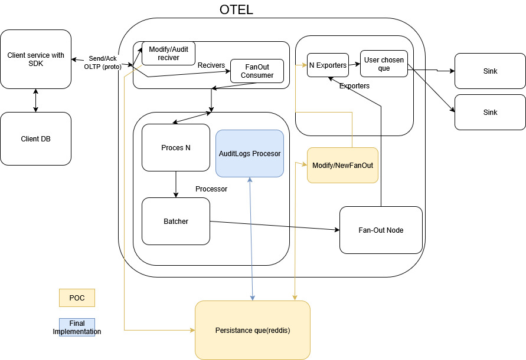

# OTEL Connector – Proposed Solutions for Audit Log Handling

This document outlines potential solutions for handling **audit logs** in the OpenTelemetry (OTEL) connector.

---

## Solution 1: Parallel Audit Log Pipeline

We propose creating a **new pipeline** dedicated to audit logs, running in parallel to the standard log pipeline. This pipeline would use a
new receiver/exporter, or additional configuration, to enable audit log flow and connect to a persistence queue.



### Receiver

We need to redirect audit logs from the standard flow to a persistence queue. Options:

1. **Modify existing receiver**: If the log is an audit log, send it to the queue.
2. **Create a new receiver**: A specialized receiver that always forwards logs to the chosen queue.

### Processor

- Audit logs **should not be modified**.
- For the proof of concept (POC), we will skip batching. This can be revisited later.

### Exporter

We need an exporter that can read from the persistence queue. Options:

1. **Modify existing fanout** to read from the queue.
2. **Create a new fanout** with queue-reading capabilities.

An fanout instance will forward logs to chosen extensions for the audit log pipeline. To guarantee delivery of logs from exporter → sink:

- If the exporter supports **persistence queues**, it will ensure delivery and send back an acknowledgment (ACK).
- If the exporter does **not** support persistence queues, we need to implement a retry mechanism in the fanout. At least once we will
  deliver log to sink.

### Example Service Config

If we go for a new receiver/fanout, the service configuration might look like:

```yaml
service:
  pipelines:
    logs:
      receivers: [otlp]
      processors: [memory_limiter, batch]
      exporters: [debug, azuremonitor, googlecloud]
    logs/audit:
      receivers: [audit]
      exporters: [audit, awscloudwatchlogs, sumologic]
```

### Notes / Unknowns / Ideas

- Maybe we can implment kafka extension, so user dont have to configure it itself

- Is it acceptable for the sink to receive duplicate logs?

- Could we build a custom connector to process logs instead?

- Do all exporters confirm successful log delivery?

- We need to send auditlogs in reciver to some persistance memory to avoid losing them. As is we lose them in receiver, sdk will not get
  ack, and will try to send them again later.

- Can we leverage existing connectors like routingConnector?

- How do different exporters handle reliability? Which guarantee log delivery? Which implements persistence que?

### Pros

- Minimal new code: mostly configuration and builder changes.

- Decouples audit log flow from standard logs.

- Low risk of introducing new bugs in existing code.

- Easy to add new endpoints for audit logs if needed.

### Cons

- Requires users to set up a persistence queue.

- Audit log pipeline may be less configurable than standard logs.

## Solution 2: Inject Persistence Queue into Module Communication

This approach involves hijacking internal communication between OTEL modules and injecting a persistence queue into every interaction.

### Requirements

A mechanism to toggle the persistence queue on/off.

Updates to consumers so they can read from the queue, or additional reader modules that pass data downstream.

<!-- markdownlint-disable MD024 -->
<!-- (no-duplicate-heading) -->

### Pros

Highly configurable audit log flow.

### Cons

Significant risk of introducing bugs in existing code.

Considerably more development effort.
