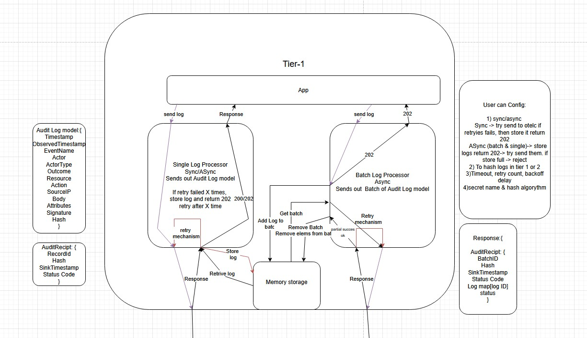

### Tier-1 Audit Log Processing and Security Proposals

This document summarizes proposed designs for Tier-1 audit log processing, hashing, transport security between SDK and OpenTelemetry Collector, and hash-chain usage, along with expected return codes and required fields.

---

### 1. Log Processing Models

#### 1.1 Single Log Processor (Sync)

**Positives**

- **Strong delivery signal per log**: app waits for send attempt result.
- **Easier to reason about ordering**: log-by-log flow.
- **Fast failure visibility**: network/sink issues seen immediately.
- **Lower in-memory queue pressure** in normal conditions.

**Negatives**

- **Higher request latency**: app path blocked by export.
- **Throughput can drop** under sink slowness or outage.
- **Can increase tail latency** for user requests.
- **Inline retries worsen blocking** when they occur.
- **Still needs fallback storage logic** to avoid dropping when retries fail.

#### 1.2 Single Log Processor (Async)

**Positives**

- **Low app impact**: returns quickly (often 202), better request latency.
- **Better resilience to temporary sink issues**: store then retry.
- **Decouples app traffic spikes from sink performance.**
- **Simpler payload semantics than batch**: one log = one unit.

**Negatives**

- **Weaker immediate delivery guarantee**: accepted != delivered yet.
- **Requires memory/storage sizing and backpressure policy.**
- **Risk of data loss** if process crashes before flush when using only non-persistent memory storage.
- **More complex observability/ops**: queue depth, retry health, age of pending logs.
- **If storage is full**, rejects can happen under sustained outage.

#### 1.3 Batch Log Processor (Async)

**Positives**

- **Best throughput and network efficiency**: amortized overhead per batch.
- **Lower sink/API cost** vs per-log sends.
- **Good for high-volume audit log traffic.**
- **Natural fit for async retry and backoff strategies.**
- **Can support partial success handling**: per-log status map in response.

**Negatives**

- **Added delivery latency**: wait for batch fill or flush interval.
- **More complex failure handling**: partial success, requeue subset.
- **Harder debugging/tracing per record** in a failed batch.
- **Memory pressure can spike** during bursts or outages.
- **Needs careful tuning**: batch size, timeout, retry count, backoff.

---

### 2. Hashing Solutions

#### 2.1 Option A: Hash in Tier-1, Verify in Tier-2

**Flow**

- Tier-1 creates hash or signature for each log.
- Tier-2 receives log plus hash.
- Tier-2 recomputes and verifies integrity.

**Positives**

- **End-to-end integrity from source**: proves log was not changed after Tier-1 created it.
- **Stronger trust model**: Tier-2 cannot silently alter content without detection.
- **Better non-repudiation** (especially with HMAC/signature and key in Tier-1).
- **Earlier tamper detection** across transport, queueing, and Tier-2 ingress.
- **Cleaner forensic story**: “source asserted this exact payload at this time.”

**Negatives**

- **Higher Tier-1 cost**: CPU plus key management on app-side pipeline.
- **Rollout complexity**: every Tier-1 sender must implement canonical hashing exactly.
- **Schema/canonicalization drift risk**: tiny format differences break validation.
- **Secret exposure surface increases** if signing keys are distributed broadly.
- **Migration harder** when changing hash algorithm or version across many clients.

#### 2.2 Option B: Hash in Tier-2, Return Hash to Tier-1 for Verify

**Flow**

- Tier-1 sends raw log.
- Tier-2 computes hash and returns it as a receipt.
- Tier-1 compares or accepts hash to check integrity.

**Positives**

- **Simpler Tier-1**: less crypto and configuration burden on producers.
- **Centralized crypto policy**: one place to manage algorithm, version, and key policy.
- **Easier upgrades**: rotate algorithms in Tier-2 without touching all clients.
- **Consistent canonicalization**: single implementation reduces mismatch bugs.
- **Operationally easier** for large fleets of senders.

**Negatives**

- **Weaker trust boundary**: Tier-2 is hashing what it received or processed, not what source originally committed to.
- **Does not prove absence of in–Tier-2 mutation before hashing** (unless pipeline is tightly controlled).
- **Tier-1 verification is limited**: confirms response consistency, not full source-to-sink immutability.
- **Potential replay or substitution concerns** if receipt binding (record ID, timestamp, nonce) is weak.
- **Forensics less strong** than source-origin hash or signature.

---

### 3. Connection SDK ↔ OpenTelemetry Collector

#### 3.1 TLS (Server-Auth TLS, One-Way TLS)

**What it secures**

- **Encryption in transit.**
- **Integrity in transit.**
- **Server authentication**: client verifies collector certificate.

**Implementation effort**

- **SDK**: low–medium (set HTTPS endpoint, trust CA or certificate).
- **Collector**: low–medium (server certificate and key configuration).
- **Usually straightforward** with OTLP/HTTP or OTLP/gRPC.

**Advantages**

- **Big security gain with moderate complexity.**
- **Standard enterprise pattern.**
- **Prevents passive sniffing and most MITM** when certificate validation is correct.

**Disadvantages**

- **Does not authenticate client identity by certificate.**
- **Certificate lifecycle management required** (renewal, rotation, trust chain).
- **Misconfiguration risk** (wrong CA, skipped verification).

#### 3.2 mTLS (Mutual TLS)

**What it secures**

- Everything TLS provides, plus:
- **Strong client authentication** via client certificate.
- **Better endpoint-to-endpoint trust.**

**Implementation effort**

- **SDK**: medium–high (client certificate and key distribution plus rotation).
- **Collector**: medium–high (require and validate client certificates).
- **PKI operations are the hard part**, not the code.

**Advantages**

- **Strongest transport-level identity.**
- **Great for zero-trust or service-to-service environments.**
- **Reduces credential replay risk** vs static tokens.

**Disadvantages**

- **Operationally heavy** (PKI, issuance, revocation, rotation).
- **Harder debugging** during certificate failures.
- **Large fleet rollout complexity.**

#### 3.3 TLS + Token/Auth Header (API Key, Bearer Token)

**What it secures**

- **TLS secures channel.**
- **Token secures application-level client authentication and authorization.**

**Implementation effort**

- **SDK**: low–medium (add headers or metadata in exporter).
- **Collector**: medium (auth extensions or processors, validation backend).
- **Often easier than mTLS operationally.**

**Advantages**

- **Easier secret distribution** than client certificate PKI.
- **Fine-grained authorization policies** are possible.
- **Works well with SaaS collectors or gateways.**

**Disadvantages**

- **Secret leakage risk** (tokens in environment, logs, or config).
- **Rotation discipline needed.**
- **Weaker client identity assurance** than mTLS.

#### 3.4 TLS + OAuth2/OIDC (Short-Lived Tokens)

**What it secures**

- Same as TLS plus token, but with **managed, short-lived credentials**.

**Implementation effort**

- **SDK**: medium–high (token acquisition and refresh flow).
- **Collector**: medium–high (JWT/OIDC validation and trust configuration).
- **More moving parts** than static token.

**Advantages**

- **Better credential hygiene** via short-lived tokens.
- **Centralized identity and policy.**
- **Good for enterprise IAM integration.**

**Disadvantages**

- **More failure modes** (IdP downtime, token refresh issues).
- **Higher implementation and operations complexity.**
- **Clock skew or configuration mismatches** can break authentication.

---

### 4. Hash Chain vs No Hash Chain

#### 4.1 With Hash Chain

**Advantages**

- **Detects record deletion**: missing link breaks chain.
- **Detects reordering or insertion**: sequence integrity is enforced.
- **Stronger tamper evidence** than per-record hash alone.
- **Supports clear forensic proofs**: “this exact sequence existed.”
- **Enables periodic signed checkpoints** (chain tip or Merkle root) for external anchoring.
- **Raises insider attack difficulty** in collector or storage.

**Disadvantages**

- **More implementation complexity** (stateful `prev_hash` management).
- **Harder horizontal scaling** if ordering or partitioning is not designed well.
- **Recovery logic needed** after crashes or restarts to preserve chain continuity.
- **Partial batch failures are trickier** (must preserve deterministic order).
- **Slight overhead** in CPU, storage, and metadata.

> Note: Tier-2 may periodically create signed checkpoints (Merkle root or chain tip) and anchor them to an external trusted store (for example, KMS-sign plus object storage/WORM, or an external ledger).

#### 4.2 Without Hash Chain

**Advantages**

- **Much simpler design and rollout.**
- **Easy parallel ingestion and scaling.**
- **Easier retries and reprocessing**: records are independent.
- **Lower operational complexity and debugging burden.**
- **Still provides per-record integrity** if each record is signed or hashed.

**Disadvantages**

- **Cannot reliably detect deletion** of valid signed records.
- **Weak protection against reordering attacks.**
- **Harder to prove completeness of timeline.**
- **Lower evidentiary strength** for audit or legal forensics.
- **Insider can remove subsets of logs** with less chance of detection.

---

### 5. Return Codes

**Per-request outcomes**

- **200** – Sent now.
- **202** – Stored for later.
- **503** – Not stored, cannot accept (buffer full), include `Retry-After`.
- **429** – Too Many Requests, only if you intentionally expose quota or rate-limit semantics.

**Error conditions**

- **400 Bad Request** – invalid payload or schema.
- **401 / 403** – authentication or authorization failure.
- **413 Payload Too Large** – single log or batch too big.
- **500 Internal Server Error** – unexpected internal failure (not a capacity policy case).

---

### 6. Fields Needed

**Core record fields**

- `timestamp` – event time.
- `observed_timestamp` – when SDK observed it.
- `event_name`
- `actor`
- `actor_type`
- `outcome`
- `resource`
- `action`
- `source_ip`
- `body`
- `attributes` – map or object.
- `record_id` – must be unique, needed for tracking and retries.
- `hash` – content hash of canonical log.
- `signature` or `hmac`.

**Additional fields (depending on implementation)**

- `tenant_id` or `service_name`
- `sequence_no` – for hash-chain ordering.
- `prev_hash` – if chain enabled.
- `schema_version`
- `hash_algorithm`
- `key_id` – which key signed it.

---

### 7. Required Response Fields from Tier-1 (to App/Caller)

#### 7.1 Single-Log Response

- `record_id`
- `status_code` – e.g. 200, 202, 503, 429.
- `status` – e.g. `delivered`, `queued`, `rejected`.
- `hash` – echo or recomputed for verification consistency.
- `sink_timestamp` – if delivered to Tier-2 now.
- `reason` – required when status is not 200, for example `storage_full` or `retry_scheduled`.

**If 202**

- `retry_after` – or retry hint.
- `queue_position` or `queued_at` – optional but useful.

**If 503 or 429**

- `retry_after` – highly recommended.

#### 7.2 Batch Response Required Fields

- `batch_id`
- `status_code` – overall.
- `hash` – batch hash or root if used.
- `sink_timestamp`
- `log_status_map` – `map[log_id][]pair{exporter_name: status}`.

---

### 8. Tier-1 Log Processing Architecture Diagram

The following diagram illustrates the overall Tier-1 architecture, including single and batch processors, retry mechanisms, and memory storage.

