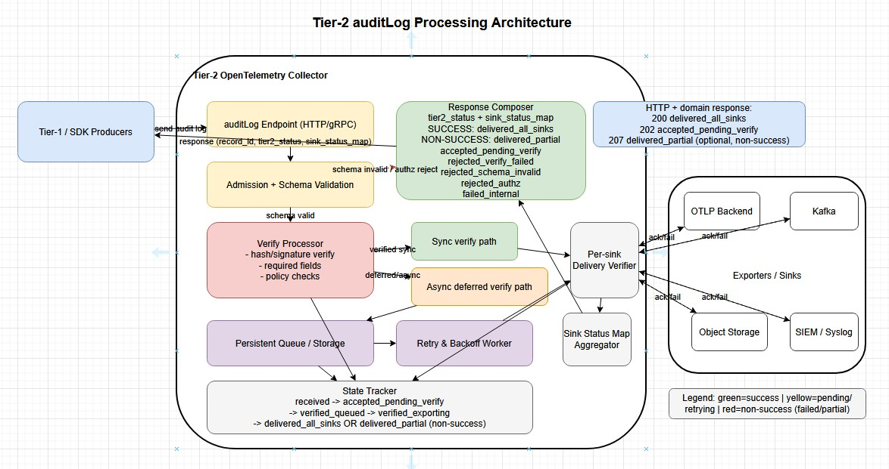

### Tier-2 AuditLog Endpoint Processing and Verification Proposals

This document summarizes proposed designs for Tier-2 audit log processing in OpenTelemetry Collector, including the new `auditLog` endpoint, verify processor behavior, custom response semantics beyond standard Tier-1 outcomes, and exporter-to-sink delivery verification.

---

### 1. Tier-2 Role and Processing Models

#### 1.1 Tier-2 as Audit Ingress Gateway (Sync Response Path)

**Positives**

- **Immediate policy evaluation**: verify processor can reject tampered or invalid records before queueing.
- **Deterministic response semantics**: caller gets explicit acceptance or rejection from Tier-2 admission logic.
- **Stronger operational control point**: one place to enforce schema, signature/hash, and tenant policy.
- **Early routing visibility**: Tier-2 can expose which pipelines/exporters are targeted per record.

**Negatives**

- **Higher ingress latency** if verify rules are expensive (signature checks, canonicalization, lookups).
- **Tight coupling to collector health**: heavy verification may reduce intake throughput under load.
- **Failure amplification risk**: if sync checks depend on unavailable subsystems, request rejections increase.
- **Requires careful timeout budgeting** to avoid blocking clients excessively.

#### 1.2 Tier-2 as Async Intake + Deferred Verification

**Positives**

- **Low endpoint latency**: `auditLog` can quickly acknowledge acceptance into durable queue.
- **Higher burst tolerance**: expensive verify logic executes out of request path.
- **Better scale profile** for high-volume audit streams.
- **Can preserve problematic events** for later forensic triage instead of dropping early.

**Negatives**

- **Acceptance is weaker signal**: accepted does not mean verified or exported.
- **More state management**: needs explicit lifecycle state transitions per record.
- **Delayed failure reporting**: clients need polling/callback/event receipt model for final status.
- **Queue/storage pressure** during prolonged exporter or verify failures.

#### 1.3 Hybrid Model (Fast Verify Inline + Deep Verify Async)

**Positives**

- **Balanced latency and assurance**: schema/basic integrity inline, advanced checks deferred.
- **Better UX for producers**: quick response plus eventual definitive exporter results.
- **Operational flexibility**: can tune which checks run where as load changes.
- **Lower blast radius** when one verification dependency degrades.

**Negatives**

- **Most complex model**: two verification layers and lifecycle reconciliation.
- **Needs clear contract** to avoid confusion between provisional and final outcomes.
- **More telemetry required** for state tracking and troubleshooting.
- **Higher implementation/testing effort** than pure sync or pure async.

---

### 2. `auditLog` Endpoint Contract

#### 2.1 Ingress Behavior

- Endpoint receives one record or a batch payload for audit-specific OTLP-compatible schema.
- Tier-2 assigns or validates `record_id` and attaches pipeline correlation metadata.
- Verify processor runs according to selected mode (sync, async, or hybrid).
- Tier-2 returns transport status and a domain-level audit processing status.

#### 2.2 Why Custom Return Values Are Needed

Standard HTTP codes alone do not express audit pipeline states such as "not yet fully delivered to all required sinks" or "accepted, verification pending." Tier-2 should return domain statuses that extend Tier-1 semantics without replacing HTTP correctness.

#### 2.3 Recommended Domain Status Values

- `accepted_pending_verify` - persisted, verify not completed yet.
- `verified_queued` - verify passed, waiting for export workers.
- `verified_exporting` - currently exporting to configured sinks.
- `delivered_all_sinks` - exported successfully to all required sinks.
- `delivered_partial` - at least one required sink failed or timed out; never treat this as successful delivery.
- `rejected_verify_failed` - verify processor rejected record.
- `rejected_schema_invalid` - schema or canonicalization failure.
- `rejected_authz` - tenant or source not authorized.
- `failed_internal` - internal Tier-2 failure prevented processing.

---

### 3. Verify Processor Design for Tier-2

#### 3.1 Verify Scope

- Canonical payload validation.
- Hash or signature/HMAC verification.
- Required field and schema-version checks.
- Optional sequence/hash-chain continuity checks.
- Optional policy checks (tenant mapping, allowed actor/action/resource patterns).

#### 3.2 Verify Output Model

For each record, verify processor should emit:

- `verify_status` - `passed`, `failed`, or `deferred`.
- `verify_reason` - machine-readable reason code.
- `verify_details` - optional structured diagnostics.
- `verified_at` - timestamp when decision made.
- `verification_profile` - policy or ruleset identifier.

#### 3.3 Failure Handling

- Hard failures reject record (`rejected_verify_failed`) when policy requires strict mode.
- Soft failures can route to quarantine pipeline for later investigation.
- Deferred verification marks record as provisional and blocks "fully delivered" state until completed.

---

### 4. Exporter Delivery Verification (Per Sink)

#### 4.1 Requirement

Tier-2 must verify whether each configured required exporter actually succeeded for a given record or batch, not only whether enqueue/export attempt started.

Success criteria are strict: the record or batch is considered successfully delivered only if every required exporter returns `success`.

#### 4.2 Per-Exporter Result Model

For every `record_id` and every required exporter:

- `exporter_name`
- `sink_type` (for example, `otlphttp`, `kafka`, `s3`, `syslog`)
- `delivery_status` - `success`, `failed`, `timeout`, `retrying`, `unknown`
- `attempt_count`
- `last_attempt_at`
- `sink_ack_id` or equivalent sink receipt identifier, when available
- `error_code` and `error_message` when not successful

#### 4.3 Overall Record Outcome Rules

- `delivered_all_sinks`: all required exporters `success`.
- `delivered_partial`: at least one required exporter not `success`; this is not a successful delivery outcome.
- `failed_internal`: collector cannot determine exporter outcomes reliably.
- Strict policy: if any required exporter is not `success`, keep retrying according to policy, and if retries are exhausted, mark final outcome as non-success.

---

### 5. Return Codes and Extended Responses

**Transport-level HTTP outcomes**

- **200** - fully processed synchronously and all required sinks confirmed.
- **202** - accepted for async verify/export; final outcome pending.
- **207** - optional for multi-sink mixed results (`delivered_partial`), and it must be treated as non-success.
- **400 Bad Request** - malformed payload, schema mismatch, canonicalization error.
- **401 / 403** - authentication/authorization failure.
- **409 Conflict** - duplicate `record_id` with incompatible payload hash.
- **413 Payload Too Large** - record or batch exceeds limits.
- **429** - intake throttled by policy.
- **500 Internal Server Error** - unexpected Tier-2 error.
- **503** - temporarily unavailable or no capacity for reliable intake.

**Response body fields (single-record)**

- `record_id`
- `http_status_code`
- `tier2_status`
- `verify_status`
- `hash`
- `received_at`
- `processed_at`
- `required_sinks`
- `sink_status_map`
- `reason`
- `retry_after` when relevant

**Response body fields (batch)**

- `batch_id`
- `http_status_code`
- `tier2_status`
- `batch_summary` (`total`, `verified`, `rejected`, `all_sinks_ok`, `partial_non_success`)
- `record_status_map`
- `sink_status_aggregate`

---

### 6. Fields Needed for Tier-2 Correlation and Auditability

**Required record fields**

- `record_id`
- `timestamp`
- `event_name`
- `actor`
- `action`
- `resource`
- `outcome`
- `body`
- `attributes`
- `hash`
- `signature` or `hmac`
- `schema_version`

**Tier-2 generated/managed fields**

- `ingest_id`
- `ingest_partition`
- `verify_status`
- `verify_reason`
- `verification_profile`
- `export_status_overall`
- `sink_status_map`
- `first_received_at`
- `last_state_change_at`

---

### 7. Tier-2 State Machine Proposal

Recommended lifecycle for each record:

`received -> accepted_pending_verify -> verified_queued -> verified_exporting -> delivered_all_sinks`

Alternative terminal states:

- `rejected_schema_invalid`
- `rejected_verify_failed`
- `rejected_authz`
- `delivered_partial`
- `failed_internal`

This state model enables clear operational dashboards, deterministic retries, and strong forensic explainability.

---

### 8. Observability and Operational Metrics

Key Tier-2 metrics should include:

- Verify pass/fail/deferred counts by reason.
- Time spent in each lifecycle state.
- Per-exporter success/failure/timeout rates.
- End-to-end latency from `received` to final terminal state.
- Queue depth and oldest pending age for deferred workflows.
- Count of `delivered_partial` records by sink and tenant.

---

### 9. Tier-2 Architecture Diagram

The Tier-2 architecture diagram for this proposal is available at:

- `docs/assets/tier-2.drawio`
- `docs/assets/tier-2.jpg`

The following diagram illustrates the Tier-2 architecture, including `auditLog` endpoint ingress, verify processor sync/async paths, queue and retry workers, per-sink delivery verification, and response composition.

